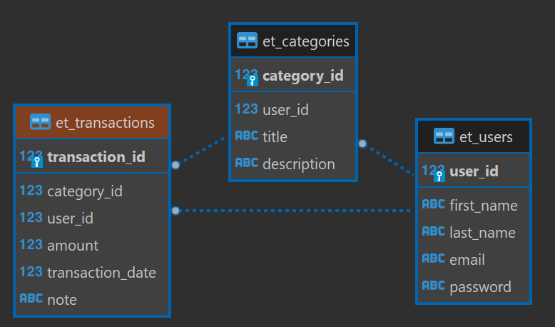

# expense-tracker-api

REST API for tracking expenses.

Technical stack:
- Spring Boot
- PostgreSQL and Jdbc Template
- JSON Web Token for authentication

Database relationship


## Setup and Installation
1. **Setup PostgreSQL database**

    There are 2 options for this step:
    - Download and install locally on the machine
    - Running a postgres docker container
     ```sh
     docker container run --name postgresdb -e POSTGRES_PASSWORD=admin -d -p 5432:5432 postgres
     ```
2. **Create database object**

    Using SQL script file expensetracker_db.sql in root directory for creating all database objects
    - if using docker, first copy this file to the running container and exec below command:
    ```
     docker container cp expensetracker_db.sql postgresdb:/
     docker container exec -it postgresdb bash
     ```
    - run the script using psql:
     ```
     psql -U postgres --file expensetracker_db.sql
     ```
3. **Update database configuration in application.properties**

    In case you have modify the database username/passoword, or host in cloud update the /src/main/resources/application.properties file:
   ```properties
   spring.datasource.url=jdbc:postgresql://localhost:5432/expensetrackerdb
   spring.datasource.username=expensetracker
   spring.datasource.password=password
   ```
4. **Run the spring boot application**
   ```sh
   ./mvnw spring-boot:run
   ```
   this runs at port 8080 and hence all enpoints can be accessed starting from http://localhost:8080
## To do
- Using Spring Data JPA for working with database
- Provide frontend for this service

## Reference
- Follow the tutorial https://www.youtube.com/watch?v=5VUjP1wMqoE&t=6135s
